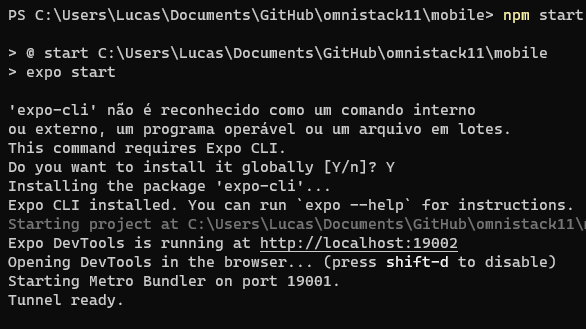
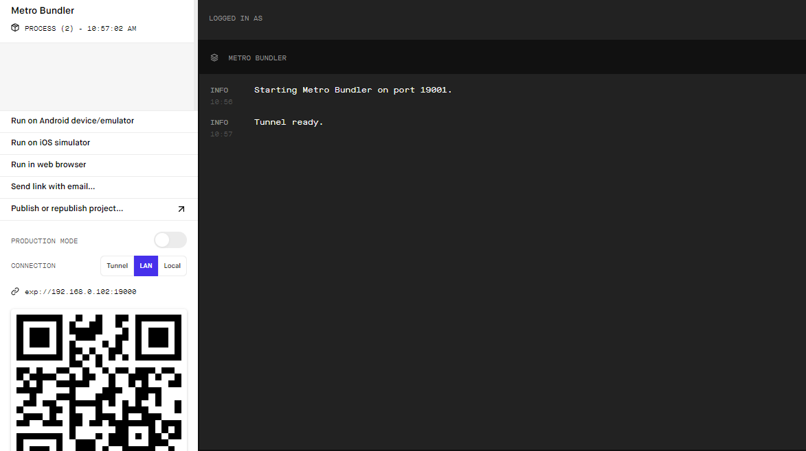

# Be The Hero

*Esse foi um projeto desenvolvido durante a Semana OmniStack 11.0.*

## Objetivo

Com um objetivo não apenas educacional, a princípio o projeto tem o intuito de ser um meio para ajudar instituições beneficentes locais, onde estas publicam um caso em que precisam de ajuda em busca de um herói para salvá-las.

## Alguns detalhes

* O backend é construído com Node.JS e SQLite;
* O fontend é construído com o framework ReactJS;
* O mobile é construído com o framework React Native e a plataforma Expo.

## Como rodar o projeto em minha máquina?

O primeiro passo é clonar o projeto, seja via terminal ou GitHub Desktop, ou mesmo baixando o arqquivo compactado (.zip). Após isso, siga adiante.

### Requisitos

* Ter o [Node.JS](https://nodejs.org/) instalado no seu computador.

### Instalando dependências

Com o Node.JS instalado, acesse cada um dos diretórios (**backend**, **frontend** e **mobile**) via terminal e rode o comando `npm install`.

### Rodando o Backend

Acesse o diretório **backend** via terminal e digite `npm start` e uma mensagem parecida com a seguinte aparecerá para você:

Obs.: Caso não tenha sido esse o resultado verifique que os requisitos e os passos anteriores tenham sido cumpridos.

### Rodando o Frontend

Acesse o diretório **frontend** via terminal e digite `npm start` e uma mensagem parecida com a seguinte aparecerá para você:

Automaticamente, em seu navegador padrão, se abrirá uma aba para o link http://localhost:3000/ (onde o projeto estará rodando).

Obs.: Caso não tenha sido esse o resultado verifique que os requisitos e os passos anteriores tenham sido cumpridos.

### Rodando o Mobile

#### Requisitos

* Aplicativo Expo instalado no seu smartphone ([Android](https://play.google.com/store/apps/details?id=host.exp.exponent) - [iOS](https://apps.apple.com/br/app/expo-client/id982107779));
* [expo-cli](https://expo.io/learn) (Expo Command Line) instalado no seu computador.

#### Passos

Acesse o diretório **mobile** via terminal e digite `npm start`. Caso você não tenha instalado o expo-cli aparecerá uma mensagem no terminal te informando isso e perguntando se você deseja instalá-lo, basta digitar `Y` e dar `enter`. 

Em seguida (e caso já tivesse o expo-cli instalado), uma mensagem parecida com a seguinte aparecerá para você:

Automaticamente, em seu navegador padrão, se abrirá uma aba para o link http://localhost:9002/ com a seguinte tela:

Como vocês puderam reparar, há um QRCode tanto no terminal, quanto no site que se abriu (ele são iguais). Agora, abra o aplicativo Expo em seu smartphone, escaneie o QRCode e aguarde até que o projeto seja sincronizado.

Obs.: Caso não tenha sido esse o resultado verifique que os requisitos e os passos anteriores tenham sido cumpridos.