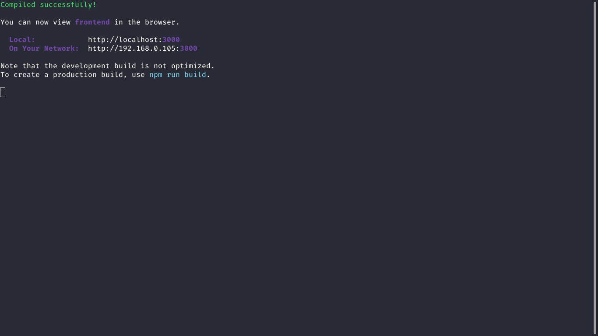

# Be The Hero :superhero:

*This was a project developed during OmniStack Week 11.0.*

## Goal :dart:

At first the project is intended to be a means to help local charities, where they publish a case in which they need help in search of a hero to save them.

## Some details :scroll:

* The back end is built with Node.JS and SQLite.
* The font end is built with ReactJS.
* The mobile is built with React Native aided by Expo.

## How do I run the project on my machine? :thinking:

The first step is to clone the project, either via terminal or GitHub Desktop, or even by downloading the compressed file (.zip). After that, go ahead.

### Requirements :hammer_and_wrench:

* [Node.JS](https://nodejs.org/).
* (Optional) [Yarn](https://yarnpkg.com/).

### Installing dependencies :mag:

With Node.JS installed, access each of the directories (**backend**, **frontend** and **mobile**) via terminal and run the `npm install` command. If you prefer to use Yarn, just run the command `yarn`.

### Running the Back end :goggles: 

Access the **backend** directory via terminal, run the command `npm start` or` yarn start` and a message similar to the following will appear for you:

> If this was not the result, check that the requirements and previous steps have been met.

### Running the Front end :sparkles:

Access the **frontend** directory via terminal, run `npm start` or `yarn start`. A message similar to the following will appear for you:

Automatically, in your default browser, a tab will open for the link http://localhost:3000/ (where the project will be running).

> If this was not the result, check that the requirements and previous steps have been fulfilled.

### Running Mobile :iphone:

#### Requirements :hammer_and_wrench:

* Expo app: ([Android](https://play.google.com/store/apps/details?id=host.exp.exponent) - [iOS](https://apps.apple.com/br/app/expo-client/id982107779)).
* [Expo Command Line](https://expo.io/learn).

#### Steps :hiking_boot:

Access the **mobile** directory via terminal and run `npm start` or` yarn start`.

Then, a message similar to the following will appear for you:

Automatically, in your default browser, a tab will open for the link http://localhost:9002/ with the following screen:

As you can see, there is a QRCode both on the terminal and on the website that opened (they are the same). Now, open the Expo app on your smartphone, scan the QRCode and wait until the project is synchronized.

> If this was not the result, check that the requirements and previous steps have been fulfilled.

## If everything went well... :tada:

Now you are running the project beautifully!