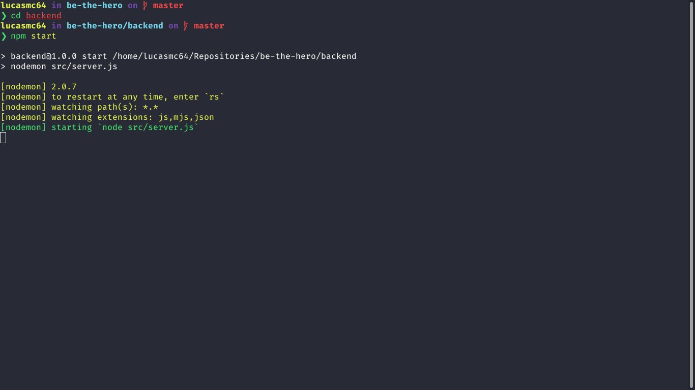

# Be The Hero :superhero:

*This was a project developed during OmniStack Week 11.0.*

## Goal :dart:

At first the project is intended to be a means to help local charities, where they publish a case in which they need help in search of a hero to save them.

## Some details :scroll:

* The backend is built with Node.JS and SQLite.
* The fontend is built with ReactJS.
* The mobile is built with React Native aided by Expo.

## How do I run the project on my machine? :thinking:

The first step is to clone the project, either via terminal or GitHub Desktop, or even by downloading the compressed file (.zip). After that, go ahead.

### Requirements :hammer_and_wrench:

* Have [Node.JS](https://nodejs.org/) installed.
* (Optional) Have [Yarn](https://yarnpkg.com/) installed.

### Installing dependencies :mag:

With Node.JS installed, access each of the directories (**backend**, **frontend** and **mobile**) via terminal and run the `npm install` command. If you prefer to use Yarn, just run the command `yarn`.

### Running the Backend :goggles: 

Access the **backend** directory via terminal and type `npm start` and a message similar to the following will appear for you:

Note: If this was not the result, check that the requirements and previous steps have been met.

### Running the Frontend ✨