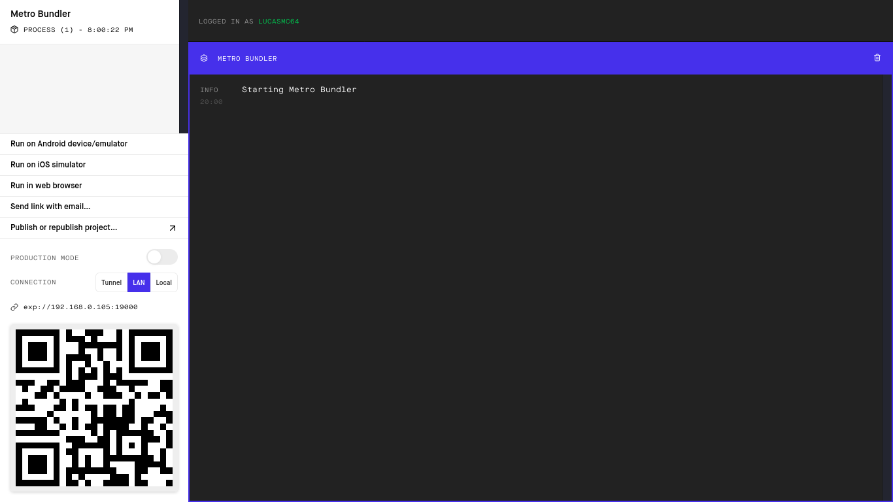

# :superhero: Be The Hero

*Esse foi um projeto desenvolvido durante a Semana OmniStack 11.0.*

## :dart: Objetivo

A princípio o projeto tem o intuito de ser um meio para ajudar instituições beneficentes locais, onde estas publicam um caso em que precisam de ajuda em busca de um herói para salvá-las.

## :scroll: Alguns detalhes 

* O back end é construído com Node.JS e SQLite.
* O font end é construído com ReactJS.
* O mobile é construído com React Native auxiliado pelo Expo.

## :thinking: Como rodar o projeto em minha máquina? 

O primeiro passo é clonar o projeto, seja via terminal ou GitHub Desktop, ou mesmo baixando o arqquivo compactado (.zip). Após isso, siga adiante.

### :hammer_and_wrench: Requisitos 

* [Node.JS](https://nodejs.org/).
* (Opcional) [Yarn](https://yarnpkg.com/).

### :mag: Instalando dependências 

Com o Node.JS instalado, acesse cada um dos diretórios (**backend**, **frontend** e **mobile**) via terminal e rode o comando `npm install`. Caso você prefira usar o Yarn, basta rodar o comando `yarn`.

### :goggles: Rodando o Back end

Acesse o diretório **backend** via terminal, rode o comando `npm start` ou `yarn start` e uma mensagem parecida com a seguinte aparecerá para você:

> Caso não tenha sido esse o resultado, verifique se os requisitos e os passos anteriores foram cumpridos.

### :sparkles: Rodando o Front end 

Acesse o diretório **frontend** via terminal, execute `npm start` ou `yarn start`. Uma mensagem parecida com a seguinte aparecerá para você:

Automaticamente, em seu navegador padrão, se abrirá uma aba para o link http://localhost:3000/ (onde o projeto estará rodando).

> Caso não tenha sido esse o resultado verifique que os requisitos e os passos anteriores tenham sido cumpridos.

### :iphone: Rodando o Mobile 

#### :hammer_and_wrench: Requisitos 

* Aplicativo Expo: ([Android](https://play.google.com/store/apps/details?id=host.exp.exponent) - [iOS](https://apps.apple.com/br/app/expo-client/id982107779)).
* [Expo Command Line](https://expo.io/learn).

#### :hiking_boot: Passos 

Acesse o diretório **mobile** via terminal e execute `npm start` ou `yarn start`.

Em seguida, uma mensagem parecida com a seguinte aparecerá para você:

Automaticamente, em seu navegador padrão, se abrirá uma aba para o link http://localhost:9002/ com a seguinte tela:

Como vocês puderam reparar, há um QRCode tanto no terminal quanto no site que se abriu (ele são iguais). Agora, abra o aplicativo Expo em seu smartphone, escaneie o QRCode e aguarde até que o projeto seja sincronizado.

> Caso não tenha sido esse o resultado verifique que os requisitos e os passos anteriores tenham sido cumpridos.

### :tada: Se tudo deu certo... 

Agora você está rodando o projeto lindamente!